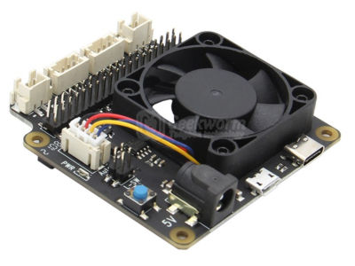

# vznncv-geekwork-x735-v2.5

Debian package version of [geekwork-x735-v2.5](https://github.com/geekworm-com/x735-v2.5) scripts.



Unlike original scripts it has the following differences:

- safe shutdown script is integrated as special *systemd* service and is activated automatically by default `shutdown`
  command.
- GPIO outputs 20 and 5 uses input mode with pull up/down resistors as safer alternative of pull/push output.
- FAN startup threshold is set to 50 C.
- FAN uses hardware PWM implementation.

## Installation

1. Build package on a control machine:

  ```shell
  ./build_debian_package.sh
  ```

2. Copy and install package to raspberry pi:

   ```shell
   sudo dpkg -i geekworm-x735-v2.5_0.1.0-1_all.deb
   sudo apt-get install --fix-broken
   ```

## Uninstallation

```
sudo apt-get remove geekworm-x735-v2.5
```

### Power consumption optimization

Fan and GPIO api uses [pigpiod](https://abyz.me.uk/rpi/pigpio/pigpiod.html), that consumes 4-6% of CPU in idle state.
To reduce CPU usage you can disable alert functionality of *pigpiod*, as it isn't requires by fan/power scripts:

1. Edit file `/usr/lib/systemd/system/pigpiod.service` to add `-m -s 10` to daemon startup options:

   ```
   # ...
   [Service]
   ExecStart=/usr/bin/pigpiod -l -m -s 10
   # ...
   ```

2. Reload systemd and restart service:

   ```
   sudo systemctl daemon-reload
   sudo systemctl restart pigpiod
   ```

## TODO

- Add fan control settings
- Add CI/CD for debian package building
